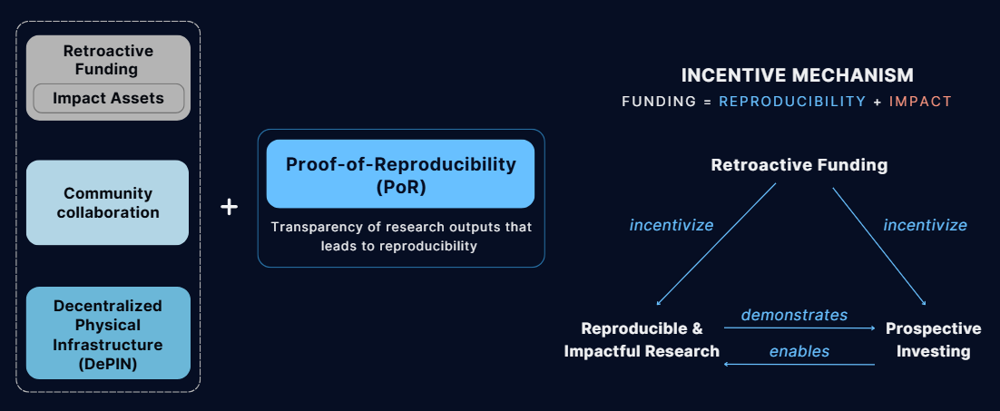

# Cairn

##  What is Cairn?

**Cairn** is protocol and platform that tracks the reuse and reproduction of scientific outputs in the field of embodied AI, and retroactively rewards impactful work (both scientific and supporting).
 
 > By leveraging decentralized storage, smart contracts, and tokenized impact assets, Cairn creates a transparent, incentive-aligned ecosystem for scientists, funders, and the broader research community.

## **Core Features:**  
  - 🔄 Tracks reuse and reproduction of scientific outputs  
  - 🏆 Retroactively rewards impactful work  
  - 🔍 Ensures transparency and data integrity  
---

## Project Motivation 

Scientific research, especially in embodied AI, faces systemic challenges:  

- **Reproducibility crisis**: A large portion of published research cannot be reliably reproduced, leading to wasted effort, erosion of trust, and slower scientific progress.  
- **Poor incentives** for long-term, impactful work: Academic recognition and funding systems tend to reward novelty and publication volume over real-world usability, long-term impact, and reproducibility.
- **Centralized funding**: Funding decisions are concentrated in a few institutions, which can limit diversity in research agendas and hinder innovation from underrepresented contributors.

---
## How Cairn solves these problems

We combined established concepts with a new system (Proof of Reproducibility) designed to provide verifiable evidence for scientific experiments:

- **Proof of Reproducibility (PoR):** Verifiable, cryptographically-secured evidence that experiments have been independently reproduced. 
- **Decentralized Storage:** All research data, models, and proofs are stored on IPFS for permanence and verifiability. 
- **Smart Contracts:** Manage project registration and proof of reproducibility, impact evaluation, and funding distribution on-chain.  
- **Hypercerts:** Tokenized certificates of impact, representing the value of scientific contributions.  
- **Retroactive Funding:** Rewards are distributed based on actual impact and reproducibility, not just proposals.  
- **DAO Governance:** Community-driven evaluation and funding decisions.

The system is designed to incentivize and validate impactful, reproducible scientific research by connecting scientists, funders, and decentralized infrastructure via a Web3-native workflow. It is built around the
Cairn platform, with various stakeholders and components described below:

> See [whitepaper](whitepaper/Cairn_whitepaper.pdf) for a detailed technical and conceptual overview. 
---

## Filecoin integration
Cairn integrates Filecoin technology as a foundational layer to ensure decentralized, secure, and verifiable storage of scientific research data and metadata:

- **Smart Contracts on the Filecoin Network:**  
  Cairn’s smart contract is currently deployed on the Filecoin calibration testnet.

- **Data Storage and Retrieval:**  
  All scientific research outputs—including datasets, machine learning models, benchmarks, and Proofs of Reproducibility (PoRs)—are stored on **IPFS**. This ensures **data provenance, immutability, and long-term availability**.

- **Crypto-based Payments with USDFC Stablecoin:**  
  Cairn uses the **USDFC stablecoin**, native to Filecoin’s ecosystem, to enable **stable, trustless, and efficient capital flows** between funders and researchers, supporting usage-based billing and retroactive funding models.

  
## All Architecture & Integrations

| Component         | Technology / Protocol         | Purpose                                              |
|-------------------|------------------------------|------------------------------------------------------|
| Storage           | **Filecoin**, **IPFS**       | Decentralized, verifiable storage of all research data and metadata |
| Payments          | **USDFC Stablecoin**         | Stable, on-chain funding and rewards                 |
| Smart Contracts   | **Filecoin Virtual Machine (FVM)** | Transparent, immutable project and funding logic     |
| Impact Assets     | **Hypercerts**                   | Tokenized, tradable proof of  impact       |

---

## How Cairn Works

Cairn provides a transparent, decentralized workflow for tracking, verifying, and rewarding impactful scientific research:

1. **Project Creation:**  
  Scientists register new research projects on-chain, minting Hypercert impact assets to represent contributions. Project metadata and outputs are stored on IPFS, with their CIDs registered on the Cairn smart contract.

2. **Recording Outputs:**  
  Models, datasets, benchmarks, and results are published to IPFS and linked to the project via smart contracts. This ensures all research outputs are verifiable and permanently available.

3. **Proof of Reproducibility (PoR):**  
  Third parties independently replicate experiments and submit cryptographically-secured PoRs—experiment logs, video proofs, and receipts—stored on IPFS and linked on-chain. This provides verifiable evidence of reproducibility.

4. **Impact Evaluation:**  
  Designated scientists, funders, and evaluators vote on each project’s impact tier, determining eligibility for retroactive funding. Future implementations will introduce DAO-based community voting.

5. **Retroactive Funding:**  
  Once a project meets the required criteria (outputs, PoRs, impact evaluation), USDFC funds are distributed proportionally to impact-asset holders based on verified impact.

**Dispute Resolution:**  
Community members can challenge submitted PoRs through a dispute mechanism, ensuring the integrity and trustworthiness of reproducibility claims.

---

See the whitepaper in the whitepaper folder for a more detalied overview of the protocol. 

---

> **Note:** For detailed setup instructions for smart contracts, frontend, and other modules, see the respective subdirectory README files.

