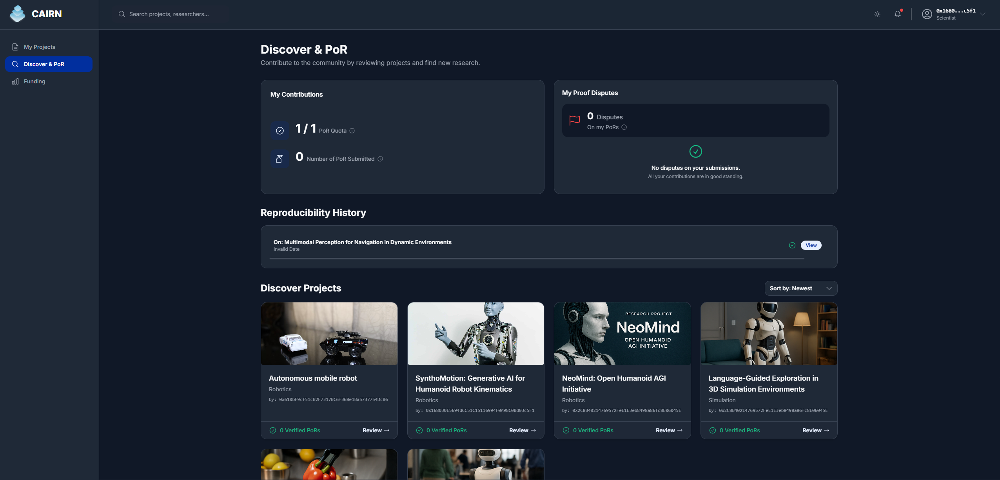

# Cairn Front End App


## 🎈Live app: https://octopus-app-5rjoy.ondigitalocean.app/ 
* See [Quick Start](#quick-start) below to help you get started.




## Overview

## Key Technologies

- **w3up-client**: A library for working with IPFS-based storage services.
- **ethers**: A library for connecting to blockchain networks and enabling decentralized features.
- **React**: Provides a component-based architecture for building interactive UIs.
- **TypeScript**: Adds static typing to JavaScript, improving code quality and maintainability.
- **Vite**: Offers lightning-fast development server and optimized production builds.
- **Tailwind CSS**: Enables rapid UI development with utility classes.


## Features

- **Decentralized Storage**: Upload and retrieve files using IPFS.
- **Blockchain Integration**: Interact with smart contracts on Filecoin Calibration test network.
- **Responsive Design**: Mobile-friendly layouts powered by Tailwind CSS.
- **Type-Safe Codebase**: Enhanced reliability and developer experience with TypeScript.

## Usage 
- Register project:
    - Use the `useRegisterProject` hook to register a new project with a name and description.

## Getting Started

1. **Install dependencies**:
    ```bash
    npm install
    ```
2. **Create a `.env` file** in the root directory and add your environment variables:
    ```env
    VITE_AGENT_KEY=xxxxx
    VITE_PROOF=xxxxx
    ```
    Replace `xxxxx` with your actual values. To see how to get these values, refer to the [w3up-client docs](https://docs.storacha.network/)
2. **Run the development server**:
    ```bash
    npm run dev
    ```
3. **Build for production**:
    ```bash
    npm run build
    ```

## Learn More

- [W3up-client](https://docs.storacha.network/)
- [Ethers Docs](https://docs.ethers.org/v5/)
- [React Documentation](https://react.dev/)
- [TypeScript Handbook](https://www.typescriptlang.org/docs/)
- [Vite Guide](https://vitejs.dev/guide/)
- [Tailwind CSS Docs](https://tailwindcss.com/docs)

### Quick Start
This is meant to be a quick start guide for users who want to quickly try out the Cairn protocol and platform.

#### Wallet Setup
1. **Install MetaMask**:  
   Download and install the [MetaMask browser extension](https://metamask.io/).
2. **Create a Wallet**:
    Follow the instructions to create a new wallet. Make sure to securely store your seed phrase.
3. **Connect to Filecoin Calibration Testnet**:
    - **Cairn app should prompt the user with correct chain data**
    - If not, you can manually add the network:
      - Open MetaMask and click on the network dropdown.
      - Select "Add Network" and enter the following details:
        - **Network Name**: Filecoin Calibration Testnet
        - **New RPC URL**: https://rpc.ankr.com/filecoin_testnet
        - Other data should be filled automatically.
#### Getting Testnet tFIL and USDFC
1. **Get tFIL**:  
   Use the [Filecoin Calibration Faucet](https://faucet.calibnet.chainsafe-fil.io/) to request testnet FIL (tFIL) for gas fees.
2. **Get USDFC**:
    Use the [USDFC Faucet](https://forest-explorer.chainsafe.dev/faucet/calibnet_usdfc) to request USDFC tokens for funding projects.

#### Submiting a Proof of Reproducibility
Before you can register a project, you need to submit a minimum of one Proof of Reproducibility (PoR) and that PoR need to get verified. The demo app takes 5 minutes.

To submit a PoR, you need to select a project with a register output